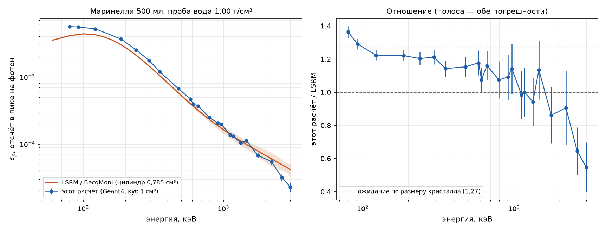

# radiacode-curves

Кривые эффективности детекторов **RadiaCode** в сосудах Маринелли — расчёт
Geant4 11.2.1 для определения активности изотопов в пробе, с учётом плотности
пробы, самопоглощения, вклада бета-излучения и ослабления фона самой пробой.

Все исходные чертежи, фотографии разборки и промеры лежат в
[`drawings/`](drawings/) и открыты к использованию.

**Статья с интерактивными графиками и калькулятором активности:
[vibeengineering-llc.github.io/radiacode-curves](https://vibeengineering-llc.github.io/radiacode-curves/)**
— там же полный разбор проверок, бюджет неопределённости и границы применимости.
Исходник страницы — [`docs/radiacode-103/article.tmpl.html`](../../docs/radiacode-103/article.tmpl.html), сборка
`python analysis/build_article.py` (данные подставляются из `results/curves.json`,
рисунки встраиваются как data-URI).

## Что посчитано

| | Прибор | Сосуд | Состояние |
|---|---|---|---|
| Кривые ε_p(E), 25 энергий × 6 матриц | 101/102/103 | 200 и 500 мл | готово |
| Сведение к формуле: гладкий предел × f(μρd) | 101/102/103 | 200 и 500 мл | готово |
| Фон и поканальный множитель k, 5 матриц | 101/102/103 | 200 и 500 мл | готово |
| Проникновение беты, 16 энергий × 5 матриц | 101/102/103 | 200 мл | готово |
| Нуклиды полным распадом (K-40, Cs-137, Ra-226, Th-232, U-238) | 101/102/103 | 200 мл | готово |
| Нуклиды: Cs-137, K-40, Sr-90 в органике 0,49 | 101/102/103 | 500 мл | готово |
| Всё то же | 110 | — | нужны размеры кристалла |

## Как этим пользоваться

```
eps_p(E, матрица, rho) = eps_lim(E) · f(mu(E)·rho·d) · 0,833
f = (1 − e^(−x)) / x,   x = mu(E)·rho·d,   d = 1,96 см (200 мл) / 2,89 см (500 мл)
A = S / (eps_p · p_gamma · t)
```

Вид множителя самопоглощения — принятая отраслевая модель: именно она применяется
в SpectraLine с версии 1.4 вместо прежней формы `exp(-mu*rho*d_eff)` (ЛСРМ,
«Алгоритмические основы», §8.5.2) и приводится для маринелли у Гилмора (гл. 10).
Отличие здесь лишь в том, что эффективная толщина не берётся из таблицы, а
подгоняется по расчётным точкам для конкретной геометрии: табличные d_eff ЛСРМ
даны для головки 63×63 мм (маринелли 0,5 л — 15±2 мм), а кристалл 1 см³ собирает
фотоны с большего расстояния, отсюда 2,89 см.

Коэффициенты `eps_lim` (полином по log E), таблица μ/ρ и всё остальное — в
[`results/curves.json`](results/curves.json), считает
[`analysis/curves.py`](analysis/curves.py). Рабочая область **50–3000 кэВ**: ниже лежат
K-края иода 33,2 и цезия 36,0 кэВ, на которых кривая имеет разрыв, и там же
перестаёт быть верной формула самопоглощения.

## Проверки модели

Расчёт абсолютный: ни один параметр не подгонялся под измерения.

| Проверка | Расчёт | Факт | Расхождение |
|---|---|---|---|
| Объём пробы, сосуд 200 мл | 199,5 см³ | 200,15 (промер STL) | 0,3 % |
| Объём пробы, сосуд 500 мл | 499,8 см³ | 498,9 (промер STL) | 0,2 % |
| H\*(10) фона помещения | 0,134 мкЗв/ч | 0,10–0,20 (типовой) | в диапазоне |
| Спектральная жёсткость фона: отношение падения счёта к падению дозы в свинцовом укрытии | 4,25 | 4,16 | 2 % |
| Площади пиков: свёртка линий против полного распада (662, 609, 352 кэВ) | — | — | 2–10 % |
| **Счёт фона в пустом сосуде** | 7,2 имп/с | 6,33 (RC-103, 7 суток) | **модель выше на 14 %** |
| **ε_p(662) в маринелли 500 мл** | 3,85·10⁻⁴ | 3,21·10⁻⁴ (по реальной пробе) | **модель выше в 1,20 раза** |
| Площадь пика 662: одна проба в домике и без домика | должно быть 1 | 1,006 ± 0,012 | 0,5 σ |
| Форма кривой, 240–1000 кэВ | — | независимый расчёт LSRM | 5 % |
| **Искажение фона пробой, k(E) по полосам** | расчёт | 3 набора, без модели | **1–3 %** |
| Сведение сетки к формуле, 800–3000 кэВ | невязка 7,9 % | статистика точек 8,1 % | только шум |

Последние две строки — систематика одного знака, и её надо учитывать (см. ниже).
Проверка по свинцовому укрытию сравнивает прибор сам с собой, поэтому не зависит
ни от размера кристалла, ни от нормировки поля, и проверяет чисто **форму**
рассчитанного спектра поля.

### Нормировка абсолютной шкалы: ε_p × 0,833 ± 0,03

Множитель выбран так, чтобы **публикуемая сглаженная кривая** воспроизводила
аттестованную привязку на реперной пробе: измеренное ε_p(662) = 3,2095·10⁻⁴
против расчётного 3,8541·10⁻⁴. Согласованность кривой и её нормировки
обязательна, иначе калькулятор не воспроизводит репер, по которому шкала и
построена. Множитель применяется к обоим сосудам: дефицит отклика — свойство
кристалла, а не сосуда.

**Про светосбор: в данных его нет.** Монте-Карло считает энерговыделение, а в пик
попадают только события с полностью собранным светом, поэтому светосбор должен
проявиться как расхождение множителей для полного счёта и для площади пика.
Проверять это надо в пределах ОДНОГО прогона, иначе сравниваются величины с
разной статистикой (`analysis/normalization.py`):

| Величина | Измерено | Расчёт | Отношение |
|---|---|---|---|
| Полный счёт пробы, имп/с | 1,8830 | 2,2486 | **0,837 ± 0,013** |
| Площадь пика 662, имп/с | 0,22441 | 0,28100 | **0,799 ± 0,035** |
| Пик / полное — это и есть светосбор | — | — | **0,954 ± 0,042** |

От единицы это **1,0 σ**: дефицита светосбора данные не показывают, верхняя
граница по этой сверке — 14 %. Прежний вывод «светосбор 0,932» был ошибкой
сравнения: полный счёт брался из прогона полного распада, а площадь пика — из
точки моносетки, у которой на 662 кэВ самопоглощение вышло 1,0012, то есть
заведомо шумное значение (поглощение не может увеличивать эффективность).

Значит вся систематика сводится к **одному** множителю 0,833, одинаковому для
пика и для полного счёта — причём полный счёт даёт его независимо от кривой,
0,837 ± 0,013. Отвечает это эффективному объёму
кристалла 0,84 см³ вместо номинального 1,0 — допуск, мёртвый слой либо
неучтённая деталь у носа. Сверка указывает туда же: расчёт LSRM, у которого
кристалл меньше моего ровно в 1,27 раза, выше измерения всего на 5,6 % ± 6,7 %,
то есть практически совпадает с ним.

Реперная точка: сушёная черника 246 г в маринелли 500 мл, RC-103, 114 121 с в
свинцовом укрытии. Опорная активность 3340 Бк/кг из приложения RadiaCode, чья
калибровка для этой геометрии сверена с аттестованным МКС-АТ1125А
(4,39 против 4,37 кБк/кг на другой пробе, согласие 0,5 %).

Прямая сверка по второй линии не удалась: K-40 1461 кэВ в том же спектре дал
37 ± 22 импульса, то есть на пределе обнаружения. Поэтому энергетический ход
получен рассуждением о механизме, а не измерен.

**Что нормировка НЕ затрагивает:** форму кривой по энергии, поправку на
самопоглощение (d = 1,9 и 2,78 см), поканальный множитель k, разделение
гамма- и бета-вклада. Это относительные величины, проверенные отношениями.

Попутно про конкретный экземпляр RC-103: энергетическая калибровка смещена на
4,3 кэВ на 662 (пик стоит на 657,4), разрешение 9,4 % против паспортных 8,4 %.

Отдельно стоит проверка по свинцовому укрытию: она сравнивает прибор сам с
собой, поэтому не зависит ни от размера кристалла, ни от нормировки поля, и
проверяет чисто **форму** рассчитанного спектра поля.

Паспортная чувствительность 30 imp/s на мкЗв/ч (Cs-137) моделью не
воспроизводится — расчёт даёт 20–24. Расхождение локализовано в определении
паспортной цифры, а не в модели: см. [«Про паспортные 30 imp/s»](#про-паспортные-30-imps).

### Сверка с независимым расчётом LSRM (BecqMoni)

Кривые сверены с расчётом LSRM из состава [BecqMoni](https://github.com/Am6er/BecqMoni) —
это второй, полностью независимый код, посчитавший тот же прибор в тех же двух
авторских маринельках. Копии моделей и выгруженных кривых с разбором различий —
в [`reference/`](reference/), сверка — `analysis/compare_lsrm.py`.
Сравнивать надо с конфигурацией **вода 1,00 г/см³**: у LSRM проба именно такая.



**Форма кривой подтверждена независимо.** В диапазоне 240–1000 кэВ, где стоят
почти все аналитические линии (Pb-212 239, Pb-214 352, Bi-214 609, Cs-137 662,
Ac-228 911), отношение двух кривых, приведённое к 1 на 662 кэВ, лежит в пределах
**5 %** — при том что кривые считались разными кодами по разным геометриям. Это и
есть та величина, от которой зависят активности по разным линиям.

**Абсолютная шкала: расхождение объяснено, а не подогнано.** Мой расчёт выше
LSRM в 1,15 раза (0,2 л) и 1,12 (0,5 л) в области 100–1500 кэВ. Ожидание из
одной геометрии кристалла — 1,27: для выпуклого тела средняя по направлениям
проекция равна S/4, у куба это 150 мм², у их цилиндра 118 мм², и точно такое же
отношение даёт объём. Остаток (1,27 → 1,15) — их колодец Ø20 мм вместо
прямоугольного, из-за которого проба подходит к кристаллу ближе. На 80 кэВ
отношение растёт до 1,38: добавляется их тяжёлый отражатель (1 мм TiO₂ — это
0,43 г/см² против моих 0,18).

**Направление нормировки подтверждено вторым кодом.** Пересчёт кривой LSRM на
плотность реальной пробы (×1,114, по самопоглощению — то, что у моделей общее):

| ε_p(662), маринелли 0,5 л, проба 0,49 г/см³ | Значение | К измерению |
|---|---|---|
| LSRM, пересчёт с воды на 0,49 | 3,54·10⁻⁴ | выше в 1,10 |
| этот расчёт | 4,11·10⁻⁴ | выше в 1,28 |
| **измерение (аттестованная привязка)** | **3,21·10⁻⁴** | — |

Независимый расчёт **тоже выше измерения**, хотя кристалл у него на 21 % меньше.
Значит остаток систематики — не объём кристалла, а то, чего нет ни в одной из
моделей: светосбор в пик. Множитель 0,80 остаётся в силе.

**Выше 1,5 МэВ расхождение не разрешается данными LSRM.** Отношение уходит к
0,72 (0,2 л) и 0,65 (0,5 л) на 2614 кэВ, но погрешность там 18–22 % **у них** и
6–12 % у меня, то есть предел точности задаёт их кривая, и досчитывать свою
статистику бессмысленно. Плюс их выгрузка строго монотонна на 150 точках при
такой заявленной погрешности — это сглаженная подгонка, а не расчётные точки.
Для линии Tl-208 2614 кэВ (торий) надёжнее явный расчёт.

## Приборы

RadiaCode 101/102/103 — корпус **123,0 × 34,0 × 17,5 мм**, сцинтиллятор
**CsI(Tl) 10×10×10 мм** на SiPM. Геометрия у всех трёх одинакова, различается
только энергетическое разрешение (9,5 % у 102, 8,4 % у 103 на 662 кэВ), которое
вводится сворачиванием спектра на этапе постобработки.

По разрезам ([продольный](drawings/rc101-103_case_side_section.png),
[план](drawings/rc101-103_case_top_section.png)): **центр** кристалла в 12,00 мм
от наружной плоскости носа, в 8,20 мм от одной большой грани и 9,30 от другой
(сумма ровно 17,5), по ширине строго по центру.

По [фотографиям разборки](drawings/rc_teardown_overview.jpg): кристалл в белой
отражающей чашке с окном под фотоприёмник, чашка — в отдельном модуле у носа,
связанном с платой шлейфом, то есть **основная плата под кристалл не заходит**;
аккумулятор Li-Po с маркировкой 602560, то есть 6,0 × 25 × 60 мм.

## Сосуды Маринелли

Промер STL лучевым сканированием сетки колонок.

| | 200 мл | 500 мл |
|---|---|---|
| Внутренний радиус | 33,24 мм | 43,34 мм |
| Высота пробы | 66,50 мм | 94,20 мм |
| Торцевая стенка | 2,80 мм | 3,30 мм |
| Стенка стакана | 2,81 мм | 2–12 мм (бочка) |
| Полость колодца | 34,70 × 18,14 мм | 36,68 × 19,78 мм |
| Стенка гильзы колодца | 1,25 мм | 1,91 мм |
| Глубина колодца | 47,81 мм | 65,60 мм |
| Смещение кристалла от центра пробы | 0,44 мм | 2,06 мм |
| Объём пробы | 200,15 см³ | 498,9 см³ |
| Пластик (стакан + крышка) | 83,0 см³ | 301,3 см³ |

Колодец в обоих повторяет форму прибора — это скруглённый прямоугольник, а не
цилиндр. У пятисотки стенка бочки толстая и переменная, так что **сам пустой
сосуд ослабляет внешний фон на 10–17 %**.

## Как считать активность

**A [Бк] = (S − B·k) / (0,80 · ε_p · p_γ · t)**,  **a [Бк/кг] = A / m**

где S — площадь пика в пробе, B — площадь того же окна в холостом наборе с
пустым сосудом, k — множитель ослабления фона пробой, p_γ — выход линии,
t — время набора, m — масса пробы.

### Эффективность и самопоглощение

Вместо таблицы по матрицам — формула с одним геометрическим параметром:

**ε_p(E, матрица, ρ) = ε_p^предел(E) · (1 − e^(−μd)) / (μd)**,  μ = ρ·(μ/ρ)(E)

Для сосуда 200 мл **d = 1,9 см**. Подгонка по 125 точкам даёт ско 6,5 % —
это в пределах статистики самих прогонов, то есть формула описывает данные
настолько точно, насколько они вообще известны. Проверено на матрицах
органика/грунт/вода при плотности 0,5–1,6 г/см³ и энергиях 30–3000 кэВ.

ε_p^предел(E) — в [`results/m200/efficiency.csv`](results/m200/efficiency.csv),
таблица по линиям ЕРН — в
[`efficiency_table.md`](results/m200/efficiency_table.md); то же для сосуда
500 мл — [`results/m500/efficiency.csv`](results/m500/efficiency.csv) и
[`efficiency_table.md`](results/m500/efficiency_table.md).

Самопоглощение расслаивает кривые **только ниже 150 кэВ**, зато там радикально:
на 30 кэВ грунт 1,6 г/см³ даёт вчетверо меньше, чем предельный случай. Выше
300 кэВ все матрицы сходятся в пределах 15 %. То есть для Pb-210 (46,5) и
Am-241 (59,5) плотность обязательна, для Cs-137 и K-40 хватит грубой оценки.

### Вклад бета-излучения

Путь от пробы до кристалла — гильза колодца, зазор, стенка корпуса и отражающая
чашка, суммарно **0,49 г/см²** у сосуда 200 мл (0,57 у 500 мл). По практическому
пробегу это порог **Emax ≈ 1,15 МэВ** (1,29 у пятисотки).

Ниже порога сигнал всё равно есть — это **тормозное излучение** беты,
затормозившейся в пробе; в этой области отклик растёт с Z матрицы. Выше порога
идут сами электроны, и там отклик падает с плотностью.

Доля заряженных частиц в полном счёте на распад (грунт 1,6 г/см³):

| Нуклид | всего/распад | доля β |
|---|---|---|
| Cs-137 | 4,35·10⁻³ | **3 %** |
| Ra-226 (равновесие) | 1,50·10⁻² | 32 % |
| U-238 (равновесие) | 1,96·10⁻³ | 35 % |
| K-40 | 5,65·10⁻⁴ | 42 % |
| **Th-232 (равновесие)** | 2,51·10⁻² | **50 %** |

У ториевой цепочки больше половины счёта дают не гамма, а бета: в ней три
жёстких бета-излучателя на распад (Ac-228 2,08 МэВ при выходе 100 %, Bi-212
2,25 МэВ при 64 %, Tl-208 1,80 МэВ при 36 %). Этот континуум ложится под все
пики и ухудшает предел обнаружения. Cs-137 на этом фоне чист.

### Поправка на искажение фона пробой

Холостой набор снимается с **пустым** сосудом, а под пробой фон уже другой.
**Знак поправки не универсален**, и это главное, что тут надо понимать:

- в **окне линии** проба гасит саму линию фона, k < 1, и вычитание холостого
  набора переподчитывает на 8–15 %;
- в **полном счёте** наоборот: рассеяние в пробе добавляет мягкий континуум, и у
  лёгких проб k > 1. Для ягод 0,49 г/см³ в пятисотке полный счёт фона растёт
  на 2 %.

Окна линий, маринелли 500 мл (`analysis/analyze_bg.py`):

| Линия | органика 0,49 | вода 1,0 | грунт 1,2 | грунт 1,6 |
|---|---|---|---|---|
| 351,9 | 0,882 | 0,851 | 0,872 | 0,842 |
| 609,3 | 0,894 | 0,870 | 0,831 | 0,783 |
| 1460,8 | 0,890 | 0,799 | 0,929 | 0,898 |

Поканально — [`background_k.csv`](results/m500/background_k.csv).

**Проверено измерениями, без модели** (`analysis/validate_bgsub.py`). У оператора есть
три набора: проба без свинцового домика, пустой сосуд без домика и та же проба
в домике, где фон подавлен в 19 раз. Собственное излучение пробы берётся из
третьего, и тогда k считается из одних измерений:

| Полоса, кэВ | k измеренное | k расчётное | Расхождение | Доля своего излучения |
|---|---|---|---|---|
| 20–100 | 1,069 ± 0,002 | 1,067 | +0,2 % | 17 % |
| 100–300 | 0,995 ± 0,002 | 0,989 | +0,6 % | 18 % |
| 300–600 | 0,968 ± 0,006 | 0,942 | +2,8 % | 51 % |
| 600–750 | 0,973 ± 0,022 | 0,894 | +8,8 % | 81 % |
| 750–1400 | 0,927 ± 0,008 | 0,916 | +1,2 % | 5 % |
| 1400–1550 | 0,901 ± 0,022 | 0,880 | +2,3 % | 3 % |
| 1550–2700 | 0,941 ± 0,017 | 0,953 | −1,3 % | 0,3 % |

Согласие 1–3 % по всему спектру. Выпадает только полоса 600–750 кэВ, и причина
в последней колонке: там 81 % счёта даёт сам пик цезия, после вычитания которого
от фона остаются крохи. Это самая содержательная проверка в работе: она проверяет
то, что иначе проверить нечем — расчёт поля ЕРН помещения плюс перенос фотонов
сквозь пробу.

Беда в том, что для проб ЕРН фоновые линии — это ровно те же линии, которые в
пробе и измеряют. Для природного калия в грунте в открытой комнате поправка
получается **больше самого сигнала**, и без неё K-40 не измеряется вовсе.
В свинцовом укрытии фон в окне 1461 падает втрое, и калий становится измеримым.

## Поле фона

Спектр поля не назначался по справочникам, а посчитан: флюенс в воздушной
полости внутри бетона с ЕРН (K-40 400, Ra-226 40, Th-232 30 Бк/кг по UNSCEAR).
Это стандартное приближение для середины помещения, окружённого ограждающими
конструкциями на полный телесный угол.

**Ключевой результат: линии дают лишь 33 % флюенса, остальные 67 % —
рассеянный континуум**, причём сосредоточенный ниже 400 кэВ, где у CsI максимум
эффективности. Поле, собранное вручную из линий, занизило бы счёт кратно.

## Про паспортные 30 imp/s

Модель даёт 20–24 imp/s на мкЗв/ч для Cs-137 против паспортных 30, то есть здесь
она, наоборот, **занижает**. Направление противоположно систематике по фону и по
маринелли, поэтому единой ошибкой эффективности это не объясняется — отклик
гладок по энергии. Вероятные причины расхождения лежат в определении паспортной
цифры:

- если она отнесена к **керме в воздухе**, а не к H\*(10), расчёт даёт 26,7;
- калибровка точечным источником **в обычном помещении** добавляет к счёту
  рассеянное от стен и пола, тогда как доза в знаменателе считается только от
  прямого пучка.

Паспортную цифру как репер использовать не стоит: условия её измерения неизвестны.
Нормировка выше построена на сверке с аттестованным прибором.

## Сборка и запуск

```bash
cmake -S sim -B sim/build -G Ninja && cmake --build sim/build
```

```bash
python drivers/run_grid.py gamma m200
```

```bash
python analysis/analyze_gamma.py m200 && python analysis/plots.py m200
```

`rc_curves <макрос> [full|bare|empty] [матрица] [плотность] [m200|m500]`.
Матрицы: water, soil, ash, organic, air. Отдельные цели: `wallfield` — спектр
поля помещения, `mucalc` — коэффициенты ослабления матриц.

## Допущения

Помечены в коде словом ДОПУЩЕНИЕ. Основные: материал корпуса прибора (АБС),
состав белой отражающей чашки, суррогат аккумулятора, толщина стенки носа,
размеры платы и дисплея. Не моделируются: резьба и рёбра сосуда, чёрный модуль
детектора вокруг чашки, заходная фаска колодца. Наружная поверхность пятисотки
не осесимметрична (рёбра) и заменена медианным по окружности обводом — сходится
по объёму пластика на 2,7 %.

## Структура

```
drawings/          чертежи, фото разборки, фото и рендеры сосудов
sim/               модель Geant4, драйверы прогонов, постобработка
reference/         независимый расчёт LSRM (BecqMoni) + разбор различий моделей
docs/              интерактивная статья (шаблон + собранная страница)
results/curves.json  коэффициенты рабочей кривой: предел, d, mu/rho
results/m200/      сосуд 200 мл: спектры, кривые, графики
results/m500/      сосуд 500 мл
```

Постобработка и проверки:

| Скрипт | Что делает |
|---|---|
| `run_grid.py`, `run_bg.py`, `run_nuc.py` | прогоны: сетка энергий, поле фона, полный распад |
| `analyze_gamma.py`, `analyze_beta.py`, `analyze_nuc.py` | кривые, бета-вклад, разделение гамма/бета |
| `analyze_bg.py` | поканальный k(E) и переподчёт в окнах линий |
| `validate_bgsub.py` | **сверка k(E) с измерениями** (три набора, без модели) |
| `compare_lsrm.py` | **сверка кривых с независимым расчётом LSRM** |
| `curves.py` | сведение сетки к формуле; выгрузка `results/curves.json` |
| `build_article.py` | сборка интерактивной статьи в `docs/` |
| `normalization.py`, `fit_peak.py`, `peaks.py` | нормировка шкалы, площади пиков, активности |
| `read_rcxml.py` | чтение спектров RadiaCode/AtomSpectra |

Все драйверы и анализаторы принимают сосуд аргументом: `python run_bg.py m500`.
